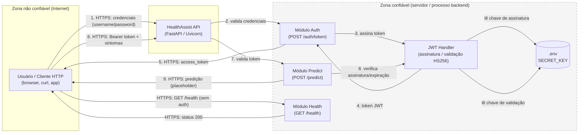

# Data Flow Diagram (DFD) — HealthAssist API

## Diagrama

**Trust boundary 1 — Internet ↔ API (borda externa):** toda requisição do
cliente cruza essa fronteira sem confiança prévia; a API deve validar
entrada (Pydantic), autenticar (JWT) e nunca confiar em dados do cliente sem
checagem.

**Trust boundary 2 — API ↔ armazenamento de segredos (`.env`):** o
`SECRET_KEY` usado para assinar/validar JWT fica isolado em variável de
ambiente, fora do código-fonte e do controle de versão (`.gitignore`).
Somente o `jwt_handler.py` acessa esse segredo.

## Entradas e Saídas por Rota

| Rota | Entrada | Saída | Cruza trust boundary? |
|---|---|---|---|
| `GET /health` | Nenhuma | JSON `{status, timestamp, version}` | Sim (boundary 1, sem autenticação) |
| `POST /auth/token` | JSON `{username, password}` | JSON `{access_token, token_type, expires_in}` ou 401 | Sim (boundary 1) |
| `POST /predict` | Header `Authorization: Bearer <token>` + JSON `{symptoms: []}` | JSON `{prediction, confidence, recommendation}` ou 401 | Sim (boundary 1); token validado internamente antes de processar (boundary 2 lógico) |

## Análise CIA (Confidencialidade, Integridade, Disponibilidade)

### 1. `SECRET_KEY` (assinatura JWT)
- **Confidencialidade:** crítica. Se vazar, qualquer pessoa forja tokens
  válidos e acessa `/predict` como usuário legítimo. Mantida fora do
  código-fonte, via variável de ambiente (`.env`, não versionado).
- **Integridade:** deve ser imutável durante o ciclo de vida dos tokens
  emitidos — trocar a chave invalida todos os tokens ativos (efeito
  aceitável como revogação de emergência).
- **Disponibilidade:** deve estar sempre acessível ao processo da API na
  inicialização; sua ausência derruba a autenticação por completo (falha
  seria de disponibilidade do serviço de auth).

### 2. Token JWT (`access_token`)
- **Confidencialidade:** deve trafegar só via HTTPS e `Authorization: Bearer`
  header; nunca logar o token em texto claro.
- **Integridade:** garantida pela assinatura HS256 — qualquer alteração no
  payload invalida a assinatura e o `jwt_handler.py` rejeita com 401.
- **Disponibilidade:** expira em 1h (`TOKEN_EXPIRATION_HOURS`), limitando a
  janela de uso de um token comprometido; renovação exige novo `/auth/token`.

### 3. Dados de sintomas enviados em `/predict` (dado de saúde, sensível sob LGPD)
- **Confidencialidade:** dado sensível de saúde — hoje trafega em texto
  claro no corpo JSON sobre HTTPS; não é persistido (MVP em memória), o que
  reduz exposição, mas exige HTTPS obrigatório em produção e cuidado para
  não logar o corpo da requisição.
- **Integridade:** validado via Pydantic (`PredictRequest`), garantindo tipo
  e estrutura antes de processar; qualquer campo fora do schema é rejeitado
  (422).
- **Disponibilidade:** rota protegida por autenticação, mas ainda sem rate
  limiting — sujeita a abuso/DoS (item planejado para a Fase 3).

### 4. Endpoint `GET /health`
- **Confidencialidade:** baixa — não expõe dados sensíveis, só status/versão.
  Deve continuar assim (evitar vazar detalhes de infraestrutura).
- **Integridade:** resposta simples e determinística; risco baixo.
- **Disponibilidade:** é o endpoint usado para monitoramento externo (ex.
  liveness probe); deve responder mesmo sob carga alta — não deve depender
  de recursos pesados (DB, auth).

## Observações para a Fase 3 (LGPD + DoS)

- Dados de sintomas em `/predict` são dado de saúde (categoria sensível na
  LGPD) — precisarão de base legal, minimização e política de retenção
  quando a persistência for implementada.
- Rate limiting e circuit breaker ainda não implementados; `/predict` e
  `/auth/token` são os alvos prioritários (autenticação por força bruta e
  abuso da rota protegida).
