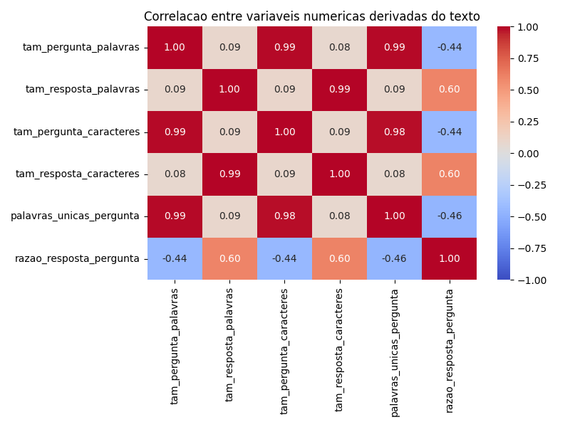
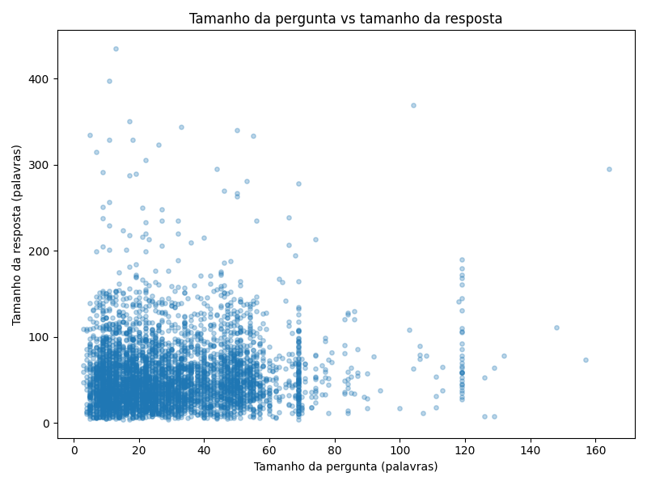
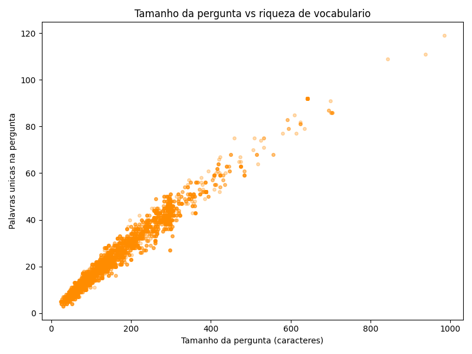

# Relatório de EDA — HealthAssist API (TP2)

## 1. Problema

O HealthAssist propõe fazer a triagem inicial de um paciente a partir do texto que ele relata (sintomas, dúvidas). Para isso, a IA precisa aprender a classificar a intenção por trás de uma pergunta médica. Este relatório aprofunda a análise exploratória iniciada no TP1 sobre o dataset MedPT, buscando entender melhor o comportamento textual das perguntas antes de avançar para a etapa de classificação (Parte 3).

## 2. Dados

- **Dataset:** MedPT (AKCIT/MedPT), amostra de 5.000 linhas.
- **Colunas:** `question` (pergunta do paciente), `answer` (resposta do profissional), `condition`, `medical_specialty`, `question_type` (categoria/intenção, 7 classes).
- **Fonte e licença:** já documentadas no TP1 (ver `README.md`); sem licença explícita, uso restrito ao contexto acadêmico.
- **Features derivadas para esta etapa:** tamanho da pergunta e da resposta (em palavras e caracteres), número de palavras únicas na pergunta (riqueza de vocabulário) e a razão entre o tamanho da resposta e da pergunta.

## 3. Análise

### 3.1 Correlação entre variáveis numéricas

O tamanho da pergunta em palavras, em caracteres e o número de palavras únicas estão fortemente correlacionados entre si (r ≈ 0.98–0.99) — o que é esperado, já que são três formas diferentes de medir a mesma coisa (o tamanho do texto). O ponto mais interessante é que o **tamanho da pergunta praticamente não se correlaciona com o tamanho da resposta** (r = 0.09): pacientes que escrevem perguntas longas não necessariamente recebem respostas mais longas.

### 3.2 Scatter plots

O gráfico confirma a baixa correlação: a maioria das respostas fica concentrada entre 0 e 150 palavras, independente do tamanho da pergunta. Existem alguns casos isolados de perguntas muito curtas (menos de 20 palavras) que geraram respostas bem longas (300+ palavras) — provavelmente perguntas objetivas sobre temas que exigem explicação técnica extensa.

Já essa relação é forte e linear (r ≈ 0.98), como esperado: quanto mais caracteres na pergunta, mais palavras únicas ela tende a ter. Não traz uma descoberta nova, mas serve como checagem de consistência dos dados (nenhum outlier estranho fugindo da linha).

### 3.3 Teste de hipótese formal

**Hipótese (formulada no TP1):** perguntas classificadas como "Diagnóstico" são mais longas do que perguntas sobre "Estilo de vida saudável".

- H0 (nula): não há diferença no tamanho das perguntas entre as duas categorias.
- H1 (alternativa): perguntas de Diagnóstico são mais longas.

Como o tamanho da pergunta é uma contagem com distribuição assimétrica (poucos valores muito altos puxando a cauda), foi usado o **teste de Mann-Whitney U** em vez do t-test, que assume normalidade.

| Grupo | n | Mediana (palavras) |
|---|---|---|
| Diagnóstico | 1.653 | 27 |
| Estilo de vida saudável | 239 | 13 |

- Estatística U: 299.262,5
- p-valor: 2,55 × 10⁻³⁸

Como o p-valor é muito menor que 0,05, **rejeitamos H0**: existe diferença estatisticamente significativa entre os dois grupos. Em linguagem acessível: não é coincidência ou acaso — perguntas sobre diagnóstico realmente tendem a ser bem mais longas (mediana quase o dobro) do que perguntas sobre hábitos saudáveis. Isso confirma a hipótese levantada no TP1 e faz sentido: pedir um diagnóstico exige descrever sintomas e contexto, enquanto perguntar sobre hábitos saudáveis costuma ser mais direto.

## 4. Insights principais

1. O tamanho da pergunta **não prediz** o tamanho da resposta — a extensão da resposta parece depender mais da complexidade médica do assunto do que da forma como o paciente escreveu.
2. A diferença de tamanho entre perguntas de Diagnóstico e de Estilo de vida saudável é estatisticamente comprovada (não é só uma impressão visual do TP1).
3. As variáveis de tamanho de texto são altamente redundantes entre si — para uma futura etapa de modelagem (Parte 3), basta manter uma delas (ex: tamanho em palavras) em vez de todas.

## 5. Limitações

- A amostra usada (5.000 de 384.000 linhas) pode não representar perfeitamente a distribuição completa do dataset original, especialmente nas categorias menos frequentes (ex: "Anatomia e fisiologia", com poucas dezenas de exemplos na amostra).
- O teste de hipótese comparou apenas 2 das 7 categorias; não foi feita uma comparação geral entre todas (isso exigiria um teste como Kruskal-Wallis, fora do escopo desta entrega).
- As features usadas são só de contagem (tamanho de texto); não houve ainda nenhuma análise semântica (ex: quais palavras aparecem mais em cada categoria).

## 6. Próximos passos (Parte 3 — fase preditiva)

- Formular a pergunta de classificação: dado o texto de `question`, prever `question_type`.
- Considerar o desbalanceamento de classes identificado no TP1 (Tratamento e Diagnóstico dominam) ao escolher a métrica de avaliação e possíveis técnicas de balanceamento.
- Avaliar uma extração de features mais rica (TF-IDF ou embeddings) além das contagens simples usadas aqui.
